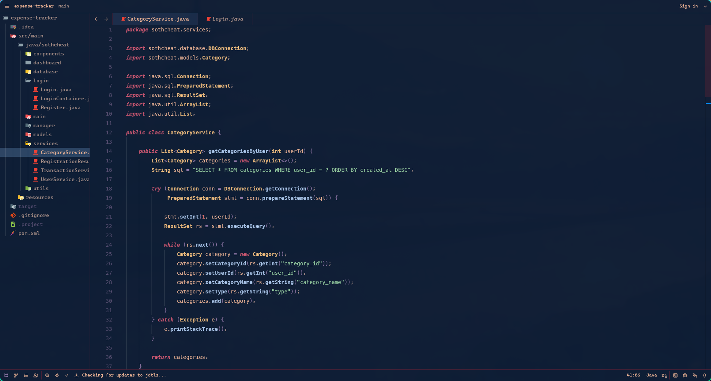

# Akane Theme

_Akane_ (茜) — meaning _"madder red"_ — captures the serene intensity of a world painted in shades of crimson and shadow. Inspired by traditional Japanese aesthetics, this artwork blends calm and chaos: a tranquil temple hidden within fiery autumn woods, under the watchful glow of a red sun.
It embodies the balance between stillness and motion, silence and passion — a reflection of nature's quiet strength and timeless beauty.

## Color Palette

- **oxford-blue** (`#0E1E36`) - Deep blue background
- **peach** (`#F4B999`) - Warm foreground text
- **african-violet** (`#9279AA`) - Keywords & highlights
- **english-violet** (`#574F72`) - UI elements
- **old-rose** (`#BE6F76`) - Types & properties
- **coral-pink** (`#FA7E75`) - Numbers & accents
- **amaranth** (`#D2495B`) - Errors
- **dark-purple** (`#4A2036`) - Subtle backgrounds

## Installation

### Visual Studio Code

1. Copy the extension to your VSCode extensions folder:
    ```bash
    # Linux/macOS
    cp -r vscode-extension ~/.vscode/extensions/akane-theme
    ```
2. Restart VSCode
3. Press `Ctrl+K Ctrl+T` and select "Akane"

### Zed Editor Support

This theme includes support for Zed editor.

**Prerequisites:** Ensure the Omarchy Akane theme is installed at `~/.config/omarchy/themes/akane/` first.

1. After installing the Omarchy theme, run:

```bash
bash ~/.config/omarchy/themes/akane/scripts/zed.sh
```

2. Restart Zed Editor
3. Press `Ctrl+K Ctrl+T` and select "Akane"

## Preview of the Theme

### 1: Main

Akane theme offers 4 backgrounds.


### 2: Others


### 3: VS Code


### 4: Zed Editor



## Color Consistency

All configurations now use the same standardized color palette. See `COLOR_REFERENCE.md` for detailed color mappings across all applications.

The theme works consistently across:

- ✅ Neovim/LazyVim
- ✅ Ghostty Terminal
- ✅ Kitty Terminal
- ✅ Alacritty Terminal
- ✅ Visual Studio Code
- ✅ Zed Editor

## Documentation

- **COLOR_REFERENCE.md** - Complete color palette documentation
- **test-colors.sh** - Terminal color verification script

## Thanks

If you like the theme, consider starring the repo or help in fixing the bug... :)
